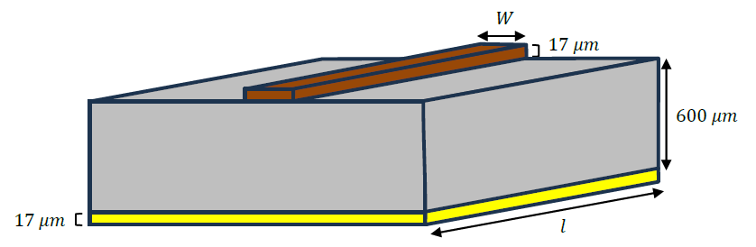
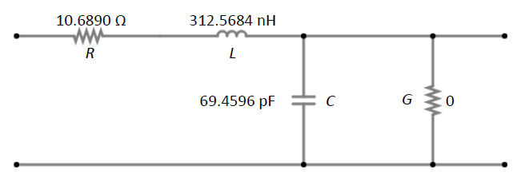
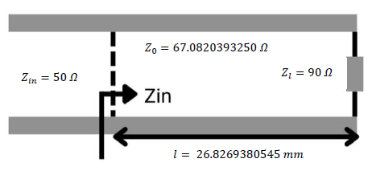
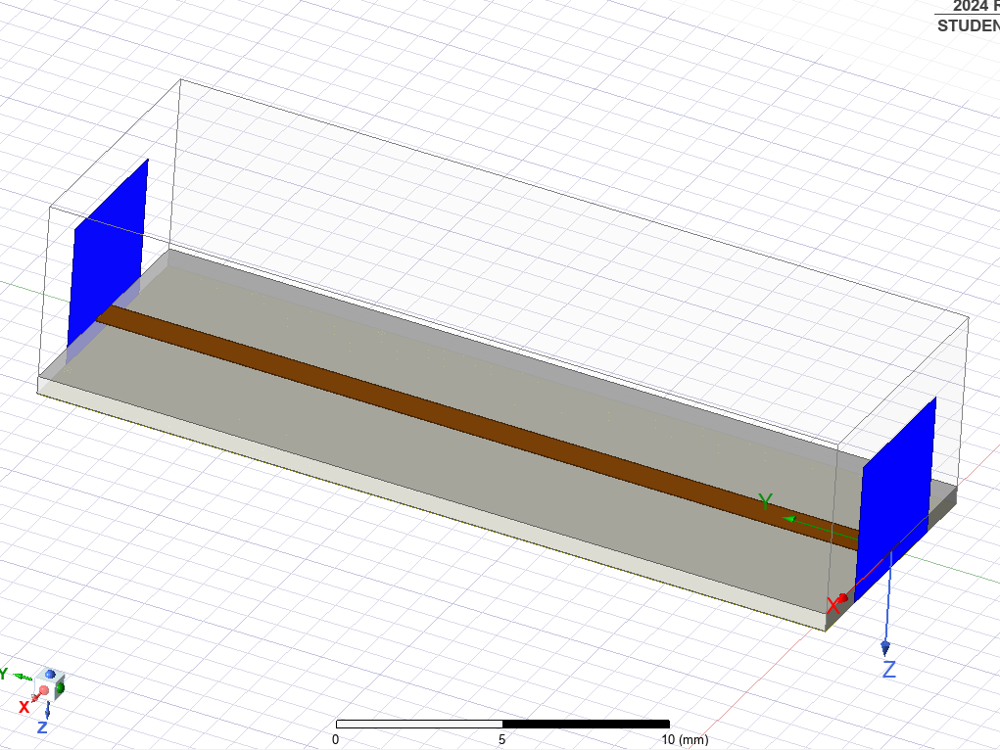
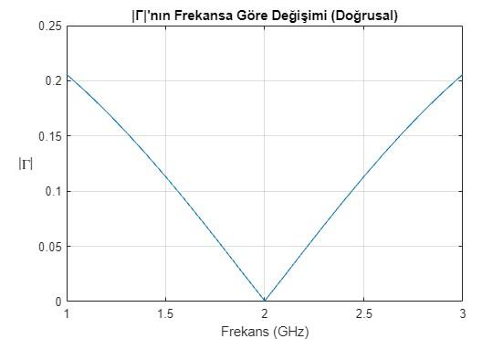
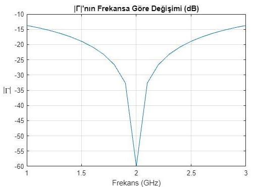
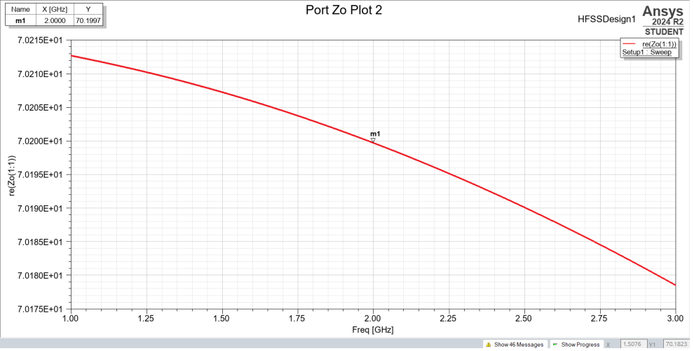
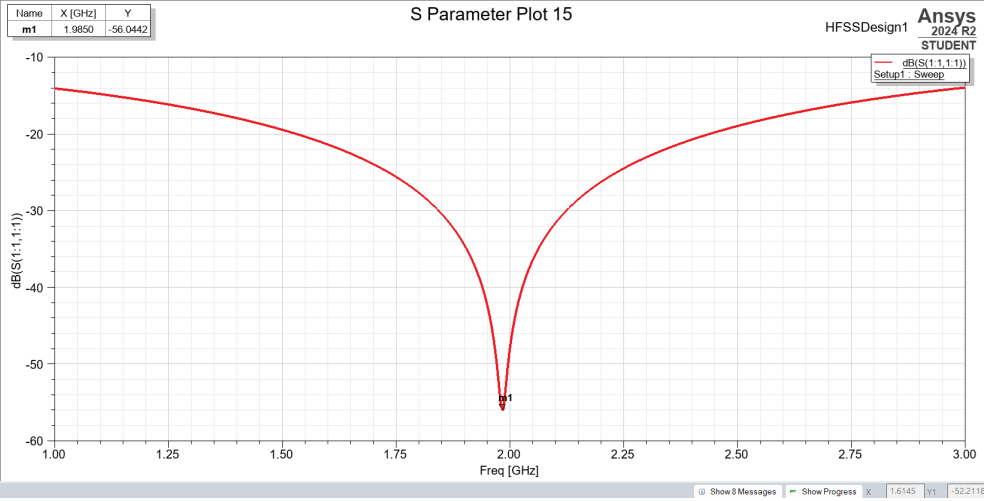
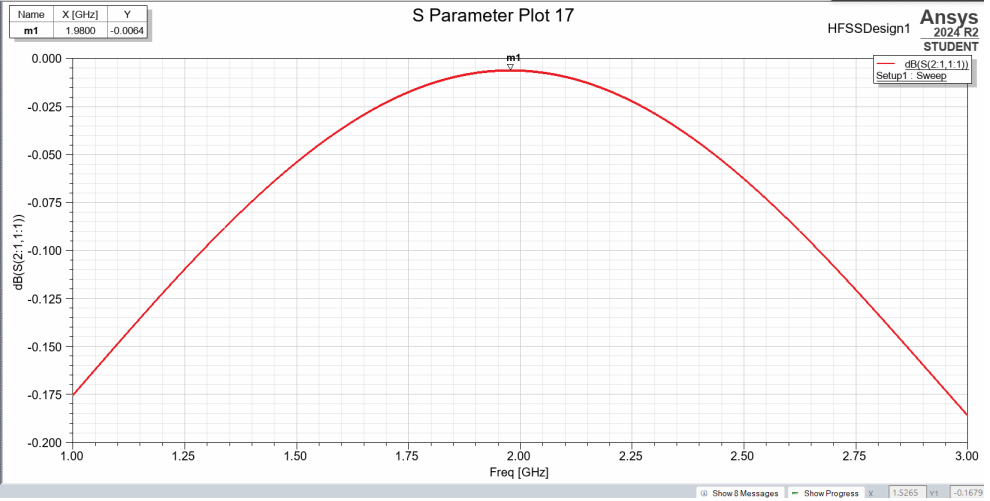
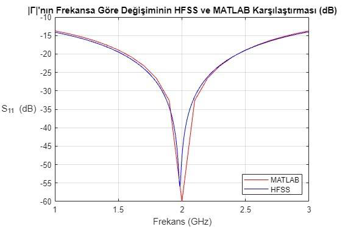

# Microstrip Quarter-Wave Impedance Transformer Design and Analysis with MATLAB & ANSYS HFSS

Design, theoretical analysis, and full-wave EM simulation of a simple and widely used impedance-matching technique in RF/microwave circuit design, microstrip quarter-wave impedance transformer (QWT) matching a 90 Ω load to a 50 Ω source at a 2 GHz center frequency, developed for the Electromagnetic Field Theory project.

## Project Requirements

The project was carried out in two stages.

**Stage 1 — Theoretical design (MATLAB)**
- a. Determine the physical width (*W*) of the microstrip line using standard line-design equations.
- b. Compute the characteristic impedance (*Z₀*), effective dielectric constant (*ε_eff*), phase constant (*β*), and attenuation constant (*α*).
- c. Compute the distributed circuit model parameters (*R*, *L*, *G*, *C*) of the line.
- d. Present a circuit schematic showing all connections of the quarter-wave transformer.
- e. Show theoretically that the transformer, with a physical length of λ_eff/4, achieves a reflection coefficient magnitude |Γ| < 0.1 at the 2 GHz center frequency, and plot |Γ| vs. frequency over the [1, 3] GHz band.

**Stage 2 — Full-wave EM simulation (ANSYS HFSS)**
- g. Build the 3D structure in HFSS using the given material properties and the dimensions obtained in Stage 1.
- h. Run the simulation over the [1, 3] GHz band with a frequency step smaller than 0.1 GHz.
- i. Extract *Z₀*, *ε_eff*, *β*, and *α* from the HFSS simulation and compare them with the Stage 1 theoretical values.
- j. Present the reflection and transmission coefficient magnitudes (S₁₁ and S₂₁, in dB) at the 50 Ω port over the [1, 3] GHz band, confirming the circuit is matched at 2 GHz.
- k. Assign 50 Ω to Port 1 (source side) and 90 Ω to Port 2 (load side) in the HFSS simulation.
- l. Confirm that the reflection coefficient magnitude at 2 GHz does not exceed 0.1 (i.e., S₁₁ < −20 dB).

The full assignment specification is included as [`ELE331_proje_202425.pdf`](./ELE331_proje_202425.pdf), and the complete write-up with derivations and results is included as [`alperen-enis_mikroserit.pdf`](./alperen-enis_mikroserit.pdf).

## Design Specifications

Microstrip mpdel


| Parameter | Value |
|---|---|
| Center frequency | 2 GHz |
| Source impedance (Z_s) | 50 Ω |
| Load impedance (Z_l) | 90 Ω |
| Substrate | Polyethylene (ε_r = 2.4, σ = 0) |
| Substrate height (h) | 600 µm |
| Conductor | Copper (σ = 5.8×10⁷ S/m) |
| Conductor thickness | 17 µm |
| Simulation band | 1–3 GHz (step < 0.1 GHz) |

## Overview

A quarter-wave transformer matches a real load impedance *Z_l* to a real source impedance *Z_s* by inserting, between them, a transmission line segment of characteristic impedance

```
Z₀ = √(Z_s · Z_l)
```

and physical length equal to one quarter of the guided wavelength at the design frequency, *l = λ_eff / 4*. At the design frequency this length rotates the load impedance around the Smith chart by 90°, presenting a purely resistive input impedance equal to *Z₀* and, in turn, equal to *Z_s* — eliminating reflections at that single frequency.

**Line width.** For a microstrip line on a substrate of relative permittivity *ε_r* and height *h*, the width-to-height ratio *W/h* is found from Pozar's synthesis equations, which take one of two forms depending on whether the resulting ratio is below or above 2:

```
W/h = 8·e^A / (e^(2A) − 2)                                         for W/h < 2

W/h = (2/π)·[B − 1 − ln(2B − 1) + ((ε_r − 1)/(2ε_r))·(ln(B − 1) + 0.39 − 0.61/ε_r)]     for W/h ≥ 2
```

where

```
A = (Z₀/60)·√((ε_r + 1)/2) + ((ε_r − 1)/(ε_r + 1))·(0.23 + 0.11/ε_r)

B = 377π / (2·Z₀·√ε_r)
```

Both cases are evaluated numerically and the applicable one (based on the resulting *W/h*) is selected to obtain *W = (W/h)·h*.

**Effective dielectric constant and phase velocity.** Because the field is partly in the dielectric and partly in air above the strip, an effective permittivity is used instead of *ε_r*:

```
ε_eff = (ε_r + 1)/2 + (ε_r − 1) / (2·√(1 + 12h/W))
```

The phase velocity, effective wavelength, and physical line length follow as:

```
v_p = c / √ε_eff

λ_eff = c / (f·√ε_eff)

l = λ_eff / 4
```

**Propagation constant.** The complex propagation constant *γ = α + jβ* is obtained from the per-unit-length distributed parameters:

```
γ = √[(R + jωL)·(G + jωC)]
```

where *β = Im(γ)* is the phase constant and *α = Re(γ)* is the attenuation constant.

Distributed model of the microstrip



**Distributed model (R, L, G, C).** The per-unit-length line parameters are computed as:

```
R = R_s / W,          R_s = √(ω·μ₀ / (2σ_c))     (conductor surface resistance, skin effect)

L = Z₀ / v_p

G = σ_dielectric · ω / h        (= 0, since the polyethylene substrate is lossless, σ_dielectric = 0)

C = 1 / (v_p · Z₀)
```

These form the equivalent circuit model of the microstrip line (series *R*, *L*; shunt *G*, *C*), used both to recompute *γ* and to evaluate the frequency response.

**Reflection coefficient across the band.** With *Z₀*, *γ*, and *l* known, the input impedance looking into the line terminated in *Z_l*, and the resulting reflection coefficient seen by the source, are:

```
Z_in(f) = Z₀ · (Z_l + Z₀·tanh(γl)) / (Z₀ + Z_l·tanh(γl))

Γ(f) = (Z_in(f) − Z_s) / (Z_in(f) + Z_s)
```

Sweeping *f* over [1, 3] GHz and evaluating |Γ(f)| verifies the narrowband matching behavior expected of a quarter-wave transformer: |Γ| falls to (near) zero at 2 GHz and rises away from it.

Microstrip quarter-wave impedance transformer schematic view



**HFSS validation.** The same geometry (copper strip and ground plane over a polyethylene substrate, dimensions from the theoretical design) is modeled in ANSYS HFSS with wave ports at each end — wave ports are used instead of lumped ports because they support full modal solutions, needed to extract *Z₀*, *ε_eff*, *β*, and *α* directly from the simulated propagating mode, rather than only a local impedance value. Port 1 (source side) is set to 50 Ω and Port 2 (load side) to 90 Ω. A frequency sweep over [1, 3] GHz with a step under 0.1 GHz yields S₁₁ and S₂₁, which are compared directly against the MATLAB-predicted |Γ(f)|.

Quarter-wave impedance transsformer design in ANSYS HFSS



## Key Results

Reflection coefficient-frequency graph in linear scale



Reflection coefficient-frequency graph in log scale



| Quantity | Theoretical (MATLAB) | HFSS Simulation |
|---|---|---|
| Line width (W) | 1.0915449469 mm | 1.09 mm (as modeled) |
| Characteristic impedance (Z₀) | 67.0820393250 Ω | 70.1997 Ω @ 2 GHz |
| Effective dielectric constant (ε_eff) | 1.9539809376 | 1.9251 @ 2 GHz |
| Effective wavelength (λ_eff) | 107.3077522182 mm | ~107.3 mm |
| Physical line length (l) | 26.8269380545 mm | 26.82 mm (as modeled) |
| Phase constant (β) | 58.5530028701 rad/m | 58.159 rad/m @ 2 GHz |
| Attenuation constant (α) | 7.9671426160×10⁻² Np/m | 0.023818 Np/m @ 2 GHz |
| Series resistance (R) | 1.0689053381×10¹ Ω/m | — |
| Series inductance (L) | 3.1256846751×10⁻⁷ H/m | — |
| Shunt conductance (G) | 0 S/m | — |
| Shunt capacitance (C) | 6.9459659446×10⁻¹¹ F/m | — |
| \|Γ\| @ 2 GHz | ≪ 0.1 (theoretical minimum) | \|S₁₁\| ≈ −56.04 dB @ 1.985 GHz |
| \|S₂₁\| @ ~2 GHz | — (not modeled analytically) | −0.0064 dB @ 1.98 GHz |
| Band where \|Γ\| < 0.1 (i.e., S₁₁ < −20 dB) | ~[1.65, 2.35] GHz | comparable band (see comparison plot) |

Characteristic impedance-frequency graph



S11 parameter-frequency graph



S21 parameter-frequency graph



MATLAB and ANSYS HFSS comparison of gamma-frequency graph



Both the analytical (MATLAB) and full-wave (HFSS) results confirm that the transformer is well matched at the 2 GHz design frequency, with the reflection coefficient far below the |Γ| < 0.1 (S₁₁ < −20 dB) requirement, and close agreement between the two methods across the full [1, 3] GHz band.